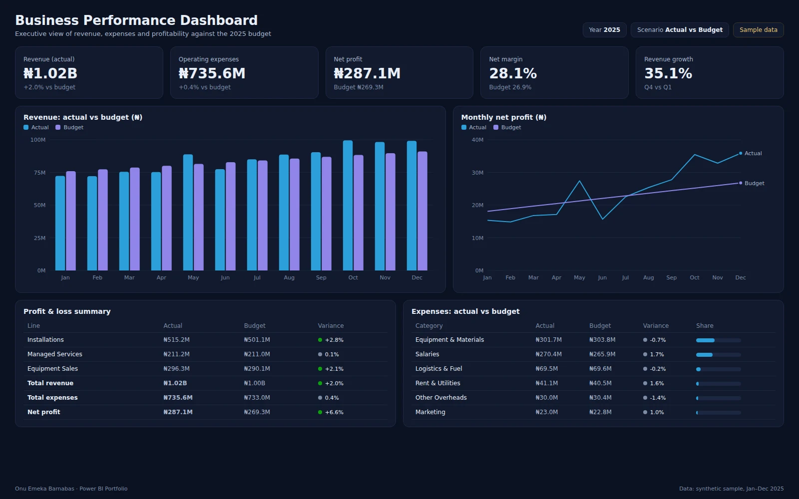

# Business Performance Dashboard

Executive dashboard monitoring financial performance against budget: revenue growth, operating expenses, net profit, margins and business KPIs for an infrastructure services company.



**Tools:** Power BI · SQL
**Data:** synthetic sample data for January–December 2025 (see [Dataset](#dataset))

## Business use case

Directors review performance monthly. They need to see whether revenue is ahead of plan, which cost lines are running over, and how that flows through to net profit. The report puts the P&L, budget variance and trend on one page so the monthly review starts from the same numbers.

### Questions the report answers

- Is revenue ahead of or behind budget, month by month?
- Which expense lines are over budget, and by how much?
- How does net profit and margin compare with plan?
- How fast is revenue growing through the year?

### Features

- Profit & loss
- Budget vs actual
- Margin analysis
- Revenue growth
- Executive KPIs

## Headline figures (sample data)

| KPI | Value | Context |
|---|---|---|
| Revenue (actual) | ₦1.02B | +2.0% vs budget |
| Operating expenses | ₦735.6M | +0.4% vs budget |
| Net profit | ₦287.1M | Budget ₦269.3M |
| Net margin | 28.1% | Budget 26.9% |
| Revenue growth | 35.1% | Q4 vs Q1 |

## Report layout

- KPI cards: revenue, expenses, net profit, net margin, growth
- Clustered column: monthly revenue, actual vs budget
- Line chart: monthly net profit, actual vs budget
- Matrix: P&L summary with variance and status icons
- Matrix: expense lines, actual vs budget, share of total

## Dataset

All files are in [`dataset/`](dataset/). The data is synthetic: generated by [`scripts/generate-data.ts`](../scripts/generate-data.ts) with a fixed seed, shaped to behave like real operations data. Names of sites, courts and people are anonymised and do not describe any real organisation.

### `actuals.csv` · Fact · 108 rows

Monthly actuals by P&L line.

| Column | Description |
|---|---|
| `Month` | First day of the month |
| `AccountType` | Revenue or Expense |
| `Category` | P&L line, e.g. Installations, Salaries |
| `ActualNGN` | Actual amount in naira |

### `budget.csv` · Fact · 108 rows

Monthly budget by P&L line.

| Column | Description |
|---|---|
| `Month` | First day of the month |
| `AccountType` | Revenue or Expense |
| `Category` | P&L line |
| `BudgetNGN` | Budgeted amount in naira |

### Data model

Create an `Account` dimension (distinct AccountType + Category) and a `Date` table. Both fact tables relate to `Account[Category]` and `Date[Date]`, so actual and budget share every slicer.

## KPI definitions and DAX measures

**Revenue (Actual)**. Actual revenue.

```dax
Revenue Actual = CALCULATE ( SUM ( actuals[ActualNGN] ), actuals[AccountType] = "Revenue" )
```

**Revenue (Budget)**. Budgeted revenue.

```dax
Revenue Budget = CALCULATE ( SUM ( budget[BudgetNGN] ), budget[AccountType] = "Revenue" )
```

**Operating Expenses**. Actual expenses across all cost lines.

```dax
Expenses Actual = CALCULATE ( SUM ( actuals[ActualNGN] ), actuals[AccountType] = "Expense" )
```

**Net Profit**. Revenue minus expenses.

```dax
Net Profit = [Revenue Actual] - [Expenses Actual]
```

**Net Margin %**. Net profit as a share of revenue.

```dax
Net Margin % = DIVIDE ( [Net Profit], [Revenue Actual] )
```

**Budget Variance %**. Actual against budget; positive is favourable for revenue, unfavourable for costs.

```dax
Revenue Var % = DIVIDE ( [Revenue Actual] - [Revenue Budget], [Revenue Budget] )
```

**Revenue Growth (Q4 vs Q1)**. Growth from the first to the last quarter.

```dax
Q4 vs Q1 % =
VAR Q1 = CALCULATE ( [Revenue Actual], 'Date'[Quarter] = 1 )
VAR Q4 = CALCULATE ( [Revenue Actual], 'Date'[Quarter] = 4 )
RETURN DIVIDE ( Q4 - Q1, Q1 )
```

## SQL

- [`sql/schema.sql`](sql/schema.sql) creates the tables (PostgreSQL syntax; load the CSVs with `\copy`).
- [`sql/kpis.sql`](sql/kpis.sql) reproduces the main KPIs so figures can be checked outside Power BI.

## Build it in Power BI Desktop

1. **Get data → Text/CSV** and load every file in `dataset/` (or connect to the SQL tables).
2. In Power Query, set column types (dates, whole numbers, decimals) and add a `Date` table (`CALENDAR(DATE(2025,1,1), DATE(2025,12,31))`) marked as a date table.
3. Create the relationships listed under **Data model**.
4. Add the DAX measures above in a dedicated `_Measures` table.
5. Build the page to match `screenshots/report.webp`, apply the theme in [`../theme/giantbase-dark.json`](../theme/giantbase-dark.json), and save as `powerbi/BusinessPerformance.pbix`.

## Files

```
Business-Performance-Dashboard/
├── README.md
├── summary.json          headline KPIs computed from the dataset
├── dataset/              CSV source data
├── sql/                  schema and KPI queries
├── screenshots/          report.webp, thumbnail.webp, report.html (static preview)
└── powerbi/              BusinessPerformance.pbix
```
