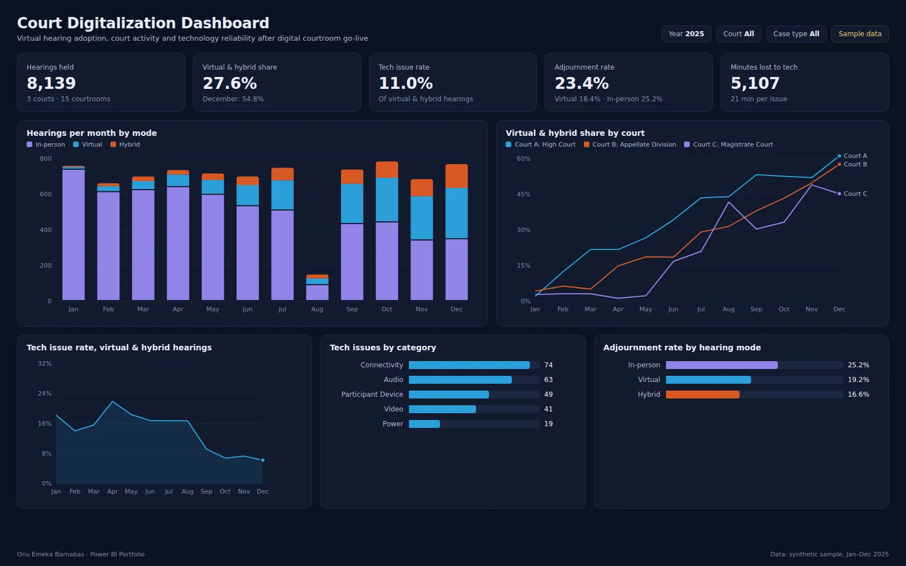

# Court Digitalization Dashboard

Analytics dashboard tracking virtual hearing adoption, court activity, technology reliability and adjournment rates after digital courtrooms go live in three courts.



**Tools:** Power BI · Excel
**Data:** synthetic sample data for January–December 2025 (see [Dataset](#dataset))

## Business use case

After courtrooms are fitted for virtual hearings, court administrators and the technology partner need evidence that the investment is used and working. The report tracks how quickly each court moves hearings online, how often technology problems interrupt a hearing and what type they are, and whether virtual hearings are adjourned less often than in-person ones.

### Questions the report answers

- What share of hearings is now virtual or hybrid, per court and per month?
- How often do technical issues interrupt virtual hearings, and is that improving?
- Which issue types (audio, video, connectivity) need the most attention?
- Do virtual and hybrid hearings get adjourned less often than in-person hearings?

### Features

- Virtual hearing metrics
- Court activity trends
- Technology utilisation
- Infrastructure monitoring
- Operational reporting

## Headline figures (sample data)

| KPI | Value | Context |
|---|---|---|
| Hearings held | 8,139 | 3 courts · 15 courtrooms |
| Virtual & hybrid share | 27.6% | December: 54.8% |
| Tech issue rate | 11.0% | Of virtual & hybrid hearings |
| Adjournment rate | 23.4% | Virtual 18.4% · In-person 25.2% |
| Minutes lost to tech | 5,107 | 21 min per issue |

## Report layout

- KPI cards: hearings, virtual & hybrid share, tech issue rate, adjournment rate, minutes lost
- Stacked column: hearings per month by mode
- Line chart: virtual & hybrid share by court
- Area chart: monthly tech issue rate
- Bar chart: issues by category
- Bar chart: adjournment rate by hearing mode

## Dataset

All files are in [`dataset/`](dataset/). The data is synthetic: generated by [`scripts/generate-data.ts`](../scripts/generate-data.ts) with a fixed seed, shaped to behave like real operations data. Names of sites, courts and people are anonymised and do not describe any real organisation.

### `hearings.csv` · Fact · 8,139 rows

One row per hearing.

| Column | Description |
|---|---|
| `HearingID` | Hearing reference |
| `Date` | Hearing date |
| `CourtID` | Court key |
| `CaseType` | Civil, Criminal, Commercial, Family or Appeal |
| `Mode` | In-person, Virtual or Hybrid |
| `DurationMinutes` | Sitting time |
| `Adjourned` | Y when the matter was adjourned |
| `TechIssue` | Y when a technical issue was logged |

### `tech_issues.csv` · Fact · 246 rows

One row per logged technical issue.

| Column | Description |
|---|---|
| `IssueID` | Issue reference |
| `HearingID` | Hearing key |
| `Date` | Date |
| `CourtID` | Court key |
| `Category` | Audio, Video, Connectivity, Participant Device or Power |
| `MinutesLost` | Sitting time lost |

### `courts.csv` · Dimension · 3 rows

Three anonymised courts.

| Column | Description |
|---|---|
| `CourtID` | Court key |
| `Court` | Court name |
| `Courtrooms` | Courtrooms fitted |
| `DigitalRoomsGoLive` | Date digital rooms went live |

### Data model

`courts` 1 → * `hearings` and `tech_issues` on CourtID; `hearings` 1 → * `tech_issues` on HearingID. Hearing logs were kept in Excel by court registries and loaded into Power BI.

## KPI definitions and DAX measures

**Hearings**. Number of hearings held.

```dax
Hearings = COUNTROWS ( hearings )
```

**Virtual & Hybrid Share %**. Hearings not held fully in person.

```dax
Virtual Share % = DIVIDE ( CALCULATE ( [Hearings], hearings[Mode] <> "In-person" ), [Hearings] )
```

**Tech Issue Rate %**. Technical issues per virtual or hybrid hearing.

```dax
Tech Issue Rate % = DIVIDE ( COUNTROWS ( tech_issues ), CALCULATE ( [Hearings], hearings[Mode] <> "In-person" ) )
```

**Adjournment Rate %**. Hearings adjourned, sliceable by mode.

```dax
Adjournment Rate % = DIVIDE ( CALCULATE ( [Hearings], hearings[Adjourned] = "Y" ), [Hearings] )
```

**Minutes Lost**. Sitting time lost to technical problems.

```dax
Minutes Lost = SUM ( tech_issues[MinutesLost] )
```

## SQL

- [`sql/schema.sql`](sql/schema.sql) creates the tables (PostgreSQL syntax; load the CSVs with `\copy`).
- [`sql/kpis.sql`](sql/kpis.sql) reproduces the main KPIs so figures can be checked outside Power BI.

## Build it in Power BI Desktop

1. **Get data → Text/CSV** and load every file in `dataset/` (or connect to the SQL tables).
2. In Power Query, set column types (dates, whole numbers, decimals) and add a `Date` table (`CALENDAR(DATE(2025,1,1), DATE(2025,12,31))`) marked as a date table.
3. Create the relationships listed under **Data model**.
4. Add the DAX measures above in a dedicated `_Measures` table.
5. Build the page to match `screenshots/report.webp`, apply the theme in [`../theme/giantbase-dark.json`](../theme/giantbase-dark.json), and save as `powerbi/CourtDigitalization.pbix`.

## Files

```
Court-Digitalization-Dashboard/
├── README.md
├── summary.json          headline KPIs computed from the dataset
├── dataset/              CSV source data
├── sql/                  schema and KPI queries
├── screenshots/          report.webp, thumbnail.webp, report.html (static preview)
└── powerbi/              CourtDigitalization.pbix
```
