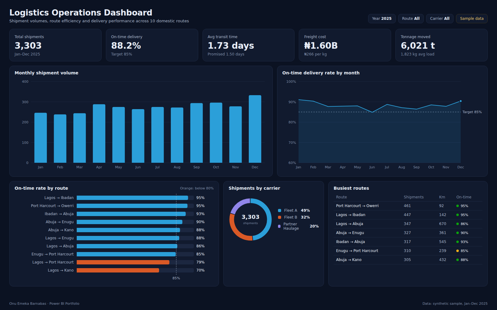

# Logistics Operations Dashboard

Interactive Power BI dashboard analysing shipment volumes, route efficiency, delivery performance and operational KPIs for a domestic haulage operation running 10 routes between 7 Nigerian cities.



**Tools:** Power BI · SQL · Excel
**Data:** synthetic sample data for January–December 2025 (see [Dataset](#dataset))

## Business use case

Operations managers need one view of whether freight is arriving on time, which routes are slipping and what each route costs. This report replaces a weekly spreadsheet roll-up: dispatch teams see late routes as they happen, and management can compare carriers before renewing contracts.

### Questions the report answers

- Are we hitting the 85% on-time delivery target, month by month?
- Which routes miss their promised transit time most often?
- How is volume split between our own fleets and partner hauliers?
- What does freight cost per kilogram, and which routes drive total cost?

### Features

- Shipment trends
- Route analysis
- Delivery performance
- Monthly volume tracking
- Operational KPIs

## Headline figures (sample data)

| KPI | Value | Context |
|---|---|---|
| Total shipments | 3,303 | Jan–Dec 2025 |
| On-time delivery | 88.2% | Target 85% |
| Avg transit time | 1.73 days | Promised 1.50 days |
| Freight cost | ₦1.60B | ₦266 per kg |
| Tonnage moved | 6,021 t | 1,823 kg avg load |

## Report layout

- KPI cards: shipments, on-time %, average transit days, freight cost, tonnage
- Clustered column: shipments by month
- Line with target: on-time % by month against the 85% target
- Bar chart: on-time % by route, conditional colour below 80%
- Donut: shipments by carrier
- Table: busiest routes with distance and on-time status icons

## Dataset

All files are in [`dataset/`](dataset/). The data is synthetic: generated by [`scripts/generate-data.mjs`](../scripts/generate-data.mjs) with a fixed seed, shaped to behave like real operations data. Names of sites, courts and people are anonymised and do not describe any real organisation.

### `shipments.csv` · Fact · 3,303 rows

One row per shipment.

| Column | Description |
|---|---|
| `ShipmentID` | Unique shipment reference |
| `ShipDate` | Date the load left the origin depot |
| `DeliveredDate` | Date the load was signed for |
| `RouteID` | Route key (joins to routes) |
| `Carrier` | Fleet A, Fleet B or Partner Haulage |
| `WeightKg` | Gross load weight |
| `PromisedDays` | Transit time promised to the customer |
| `ActualDays` | Days from dispatch to delivery |
| `OnTime` | Y when ActualDays ≤ PromisedDays |
| `FreightCostNGN` | Total freight cost in naira |

### `routes.csv` · Dimension · 10 rows

One row per route.

| Column | Description |
|---|---|
| `RouteID` | Route key |
| `Origin` | Origin city |
| `Destination` | Destination city |
| `DistanceKm` | Road distance |
| `TargetDays` | Standard transit time for the route |

### Data model

`routes[RouteID]` 1 → * `shipments[RouteID]`. Add a `Date` table marked as a date table and relate it to `shipments[ShipDate]`.

## KPI definitions and DAX measures

**Total Shipments**. Count of shipments in the filter context.

```dax
Total Shipments = COUNTROWS ( shipments )
```

**On-Time Delivery %**. Share of shipments delivered within the promised days. Target 85%.

```dax
On-Time % = DIVIDE ( CALCULATE ( [Total Shipments], shipments[OnTime] = "Y" ), [Total Shipments] )
```

**Avg Transit Days**. Average actual days in transit, compared with the promised average.

```dax
Avg Transit Days = AVERAGE ( shipments[ActualDays] )
```

**Freight Cost**. Total freight spend in naira.

```dax
Freight Cost = SUM ( shipments[FreightCostNGN] )
```

**Cost per kg**. Freight cost divided by kilograms moved; the fairest way to compare long and short routes.

```dax
Cost per kg = DIVIDE ( [Freight Cost], SUM ( shipments[WeightKg] ) )
```

## SQL

- [`sql/schema.sql`](sql/schema.sql) creates the tables (PostgreSQL syntax; load the CSVs with `\copy`).
- [`sql/kpis.sql`](sql/kpis.sql) reproduces the main KPIs so figures can be checked outside Power BI.

## Build it in Power BI Desktop

1. **Get data → Text/CSV** and load every file in `dataset/` (or connect to the SQL tables).
2. In Power Query, set column types (dates, whole numbers, decimals) and add a `Date` table (`CALENDAR(DATE(2025,1,1), DATE(2025,12,31))`) marked as a date table.
3. Create the relationships listed under **Data model**.
4. Add the DAX measures above in a dedicated `_Measures` table.
5. Build the page to match `screenshots/report.png`, apply the theme in [`../theme/giantbase-dark.json`](../theme/giantbase-dark.json), and save as `powerbi/Logistics.pbix`.

## Files

```
Logistics-Dashboard/
├── README.md
├── summary.json          headline KPIs computed from the dataset
├── dataset/              CSV source data
├── sql/                  schema and KPI queries
├── screenshots/          report.png, thumbnail.png, report.html (static preview)
└── powerbi/              Logistics.pbix
```
