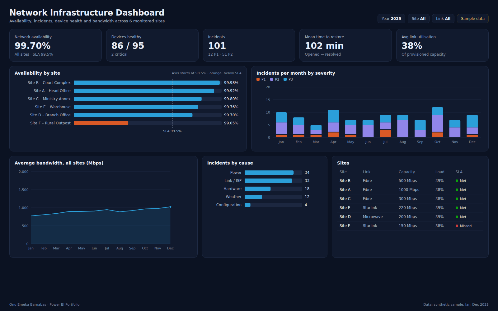

# Network Infrastructure Dashboard

Operational dashboard monitoring network availability, uptime, incidents, bandwidth utilisation and device health across six sites connected by fibre, microwave and Starlink.



**Tools:** Power BI · SQL
**Data:** synthetic sample data for January–December 2025 (see [Dataset](#dataset))

## Business use case

A network operations team has to show clients that each site meets its 99.5% availability SLA, and has to decide where to spend on redundancy. The report combines daily uptime, the incident log and the device inventory: it shows which sites miss SLA, what causes outages, and whether links are close to capacity.

### Questions the report answers

- Is every site meeting the 99.5% availability SLA?
- How many P1/P2 incidents occurred each month, and what caused them?
- How long does it take to restore service (MTTR)?
- How loaded are the links compared with provisioned capacity?

### Features

- Uptime monitoring
- Device health
- Incident tracking
- Bandwidth usage
- Site availability

## Headline figures (sample data)

| KPI | Value | Context |
|---|---|---|
| Network availability | 99.70% | All sites · SLA 99.5% |
| Devices healthy | 86 / 95 | 2 critical |
| Incidents | 101 | 12 P1 · 51 P2 |
| Mean time to restore | 102 min | Opened → resolved |
| Avg link utilisation | 38% | Of provisioned capacity |

## Report layout

- KPI cards: availability, devices healthy, incidents, MTTR, link utilisation
- Bar chart: availability by site with 99.5% SLA reference line (axis starts at 98.5%)
- Stacked column: incidents per month by severity
- Area chart: average bandwidth across all sites
- Bar chart: incidents by cause
- Table: sites with link type, capacity, load and SLA status icon

## Dataset

All files are in [`dataset/`](dataset/). The data is synthetic: generated by [`scripts/generate-data.mjs`](../scripts/generate-data.mjs) with a fixed seed, shaped to behave like real operations data. Names of sites, courts and people are anonymised and do not describe any real organisation.

### `daily_site_metrics.csv` · Fact · 2,190 rows

One row per site per day.

| Column | Description |
|---|---|
| `Date` | Calendar day |
| `SiteID` | Site key |
| `UptimeMinutes` | Minutes the primary link was up (of 1,440) |
| `DowntimeMinutes` | Minutes down |
| `AvgUtilisationMbps` | Average throughput |
| `PeakUtilisationMbps` | Peak throughput |

### `incidents.csv` · Fact · 101 rows

One row per incident ticket.

| Column | Description |
|---|---|
| `IncidentID` | Ticket reference |
| `SiteID` | Site key |
| `Opened` | Ticket opened (local time) |
| `Resolved` | Service restored |
| `Severity` | P1 (major) to P3 (minor) |
| `Category` | Power, Link / ISP, Hardware, Configuration or Weather |
| `ResolutionMinutes` | Minutes to restore |

### `devices.csv` · Dimension · 95 rows

Device inventory.

| Column | Description |
|---|---|
| `DeviceID` | Asset tag |
| `SiteID` | Site key |
| `DeviceType` | Router, switch, access point, firewall, NVR, UPS |
| `Vendor` | MikroTik, Cisco, Ubiquiti, Hikvision, APC |
| `Status` | Healthy, Warning or Critical |

### `sites.csv` · Dimension · 6 rows

Six anonymised sites.

| Column | Description |
|---|---|
| `SiteID` | Site key |
| `Site` | Site name |
| `PrimaryLink` | Fibre, Microwave or Starlink |
| `CapacityMbps` | Provisioned bandwidth |

### Data model

`sites` 1 → * `daily_site_metrics`, `incidents` and `devices` on SiteID. `Date` relates to `daily_site_metrics[Date]` and to a date column derived from `incidents[Opened]`.

## KPI definitions and DAX measures

**Availability %**. Uptime minutes over total minutes in the period.

```dax
Availability % = DIVIDE ( SUM ( daily_site_metrics[UptimeMinutes] ), COUNTROWS ( daily_site_metrics ) * 1440 )
```

**SLA Met**. Flag per site: availability at or above 99.5%.

```dax
SLA Status = IF ( [Availability %] >= 0.995, "Met", "Missed" )
```

**Incidents**. Number of incident tickets.

```dax
Incidents = COUNTROWS ( incidents )
```

**MTTR (min)**. Mean time to restore service.

```dax
MTTR = AVERAGE ( incidents[ResolutionMinutes] )
```

**Devices Healthy**. Devices reporting healthy over total devices.

```dax
Devices Healthy = CALCULATE ( COUNTROWS ( devices ), devices[Status] = "Healthy" )
```

**Link Utilisation %**. Average throughput over provisioned capacity.

```dax
Link Utilisation % = DIVIDE ( AVERAGE ( daily_site_metrics[AvgUtilisationMbps] ), AVERAGE ( sites[CapacityMbps] ) )
```

## SQL

- [`sql/schema.sql`](sql/schema.sql) creates the tables (PostgreSQL syntax; load the CSVs with `\copy`).
- [`sql/kpis.sql`](sql/kpis.sql) reproduces the main KPIs so figures can be checked outside Power BI.

## Build it in Power BI Desktop

1. **Get data → Text/CSV** and load every file in `dataset/` (or connect to the SQL tables).
2. In Power Query, set column types (dates, whole numbers, decimals) and add a `Date` table (`CALENDAR(DATE(2025,1,1), DATE(2025,12,31))`) marked as a date table.
3. Create the relationships listed under **Data model**.
4. Add the DAX measures above in a dedicated `_Measures` table.
5. Build the page to match `screenshots/report.png`, apply the theme in [`../theme/giantbase-dark.json`](../theme/giantbase-dark.json), and save as `powerbi/NetworkInfrastructure.pbix`.

## Files

```
Network-Infrastructure-Dashboard/
├── README.md
├── summary.json          headline KPIs computed from the dataset
├── dataset/              CSV source data
├── sql/                  schema and KPI queries
├── screenshots/          report.png, thumbnail.png, report.html (static preview)
└── powerbi/              NetworkInfrastructure.pbix
```
