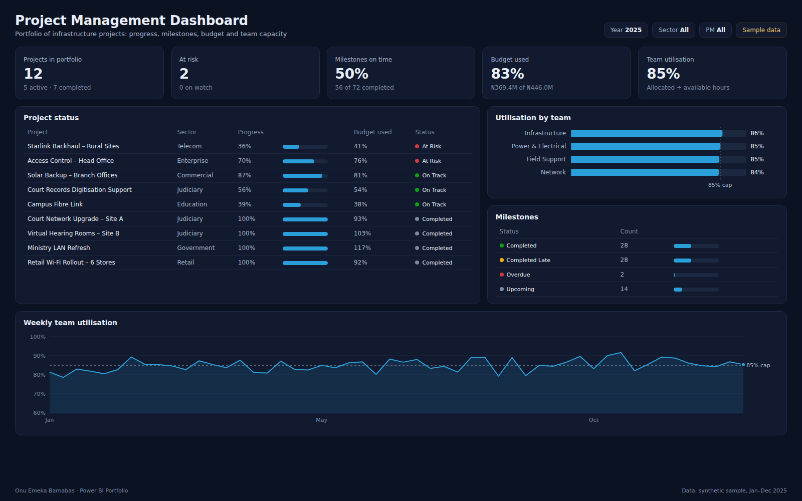

# Project Management Dashboard

Project portfolio dashboard tracking progress, milestones, budget use, resource utilisation, risk indicators and delivery status across 12 infrastructure projects.



**Tools:** Power BI · Excel
**Data:** synthetic sample data for January–December 2025 (see [Dataset](#dataset))

## Business use case

A delivery lead running several installation projects at once needs to see which ones need attention this week. The report brings together the project register, the milestone plan and the team timesheet so status meetings start from facts: what is at risk, which milestones slipped, and whether the team has capacity for new work.

### Questions the report answers

- Which projects are at risk, and why (progress vs budget used)?
- How many milestones were delivered on time, late, or are overdue?
- Is any team running above the 85% utilisation cap?
- How much of the approved budget has been spent?

### Features

- Active projects
- Milestone tracking
- Resource utilisation
- Budget monitoring
- Status reporting

## Headline figures (sample data)

| KPI | Value | Context |
|---|---|---|
| Projects in portfolio | 12 | 5 active · 7 completed |
| At risk | 2 | 0 on watch |
| Milestones on time | 50% | 56 of 72 completed |
| Budget used | 83% | ₦369.4M of ₦446.0M |
| Team utilisation | 85% | Allocated ÷ available hours |

## Report layout

- KPI cards: portfolio size, at risk, milestones on time, budget used, utilisation
- Table: project status with progress bars and status icons, sorted by risk
- Bar chart: utilisation by team against the 85% cap
- Table: milestone status counts
- Line chart: weekly utilisation across the year

## Dataset

All files are in [`dataset/`](dataset/). The data is synthetic: generated by [`scripts/generate-data.mjs`](../scripts/generate-data.mjs) with a fixed seed, shaped to behave like real operations data. Names of sites, courts and people are anonymised and do not describe any real organisation.

### `projects.csv` · Fact / dimension · 12 rows

Project register, one row per project.

| Column | Description |
|---|---|
| `ProjectID` | Project key |
| `ProjectName` | Project name |
| `Sector` | Client sector |
| `ProjectManager` | Anonymised PM |
| `StartDate` | Start date |
| `PlannedEndDate` | Baseline finish |
| `BudgetNGN` | Approved budget |
| `SpentNGN` | Spend to date |
| `PercentComplete` | Progress at 31 Dec 2025 |
| `Status` | On Track, Watch, At Risk or Completed |

### `milestones.csv` · Fact · 72 rows

Six stage-gate milestones per project.

| Column | Description |
|---|---|
| `ProjectID` | Project key |
| `Milestone` | Site Survey → Handover & Training |
| `PlannedDate` | Baseline date |
| `ActualDate` | Blank until achieved |
| `Status` | Completed, Completed Late, Overdue or Upcoming |

### `resource_utilisation.csv` · Fact · 728 rows

Weekly hours per engineer.

| Column | Description |
|---|---|
| `WeekStarting` | Monday of the week |
| `Engineer` | Anonymised engineer |
| `Team` | Network, Infrastructure, Power & Electrical or Field Support |
| `HoursAvailable` | Contracted hours less leave |
| `HoursAllocated` | Hours booked to projects |

### Data model

`projects` 1 → * `milestones` on ProjectID. `resource_utilisation` relates to a `Date` table on WeekStarting. Built in Excel first (the register and timesheet), then loaded to Power BI.

## KPI definitions and DAX measures

**Active Projects**. Projects not yet completed.

```dax
Active Projects = CALCULATE ( COUNTROWS ( projects ), projects[Status] <> "Completed" )
```

**At Risk**. Projects flagged At Risk.

```dax
At Risk = CALCULATE ( COUNTROWS ( projects ), projects[Status] = "At Risk" )
```

**Milestones On Time %**. Achieved milestones delivered by their planned date.

```dax
Milestones On Time % =
DIVIDE (
    CALCULATE ( COUNTROWS ( milestones ), milestones[Status] = "Completed" ),
    CALCULATE ( COUNTROWS ( milestones ), NOT ISBLANK ( milestones[ActualDate] ) )
)
```

**Budget Used %**. Spend to date against approved budget.

```dax
Budget Used % = DIVIDE ( SUM ( projects[SpentNGN] ), SUM ( projects[BudgetNGN] ) )
```

**Utilisation %**. Allocated hours over available hours. Above 85% means no slack for fault calls.

```dax
Utilisation % = DIVIDE ( SUM ( resource_utilisation[HoursAllocated] ), SUM ( resource_utilisation[HoursAvailable] ) )
```

## SQL

- [`sql/schema.sql`](sql/schema.sql) creates the tables (PostgreSQL syntax; load the CSVs with `\copy`).
- [`sql/kpis.sql`](sql/kpis.sql) reproduces the main KPIs so figures can be checked outside Power BI.

## Build it in Power BI Desktop

1. **Get data → Text/CSV** and load every file in `dataset/` (or connect to the SQL tables).
2. In Power Query, set column types (dates, whole numbers, decimals) and add a `Date` table (`CALENDAR(DATE(2025,1,1), DATE(2025,12,31))`) marked as a date table.
3. Create the relationships listed under **Data model**.
4. Add the DAX measures above in a dedicated `_Measures` table.
5. Build the page to match `screenshots/report.png`, apply the theme in [`../theme/giantbase-dark.json`](../theme/giantbase-dark.json), and save as `powerbi/ProjectManagement.pbix`.

## Files

```
Project-Management-Dashboard/
├── README.md
├── summary.json          headline KPIs computed from the dataset
├── dataset/              CSV source data
├── sql/                  schema and KPI queries
├── screenshots/          report.png, thumbnail.png, report.html (static preview)
└── powerbi/              ProjectManagement.pbix
```
