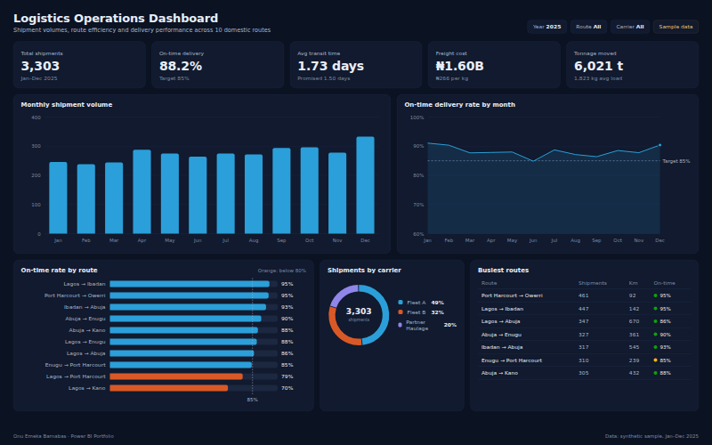
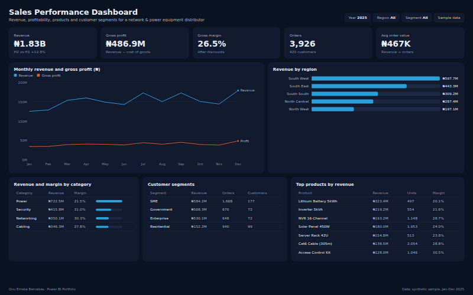
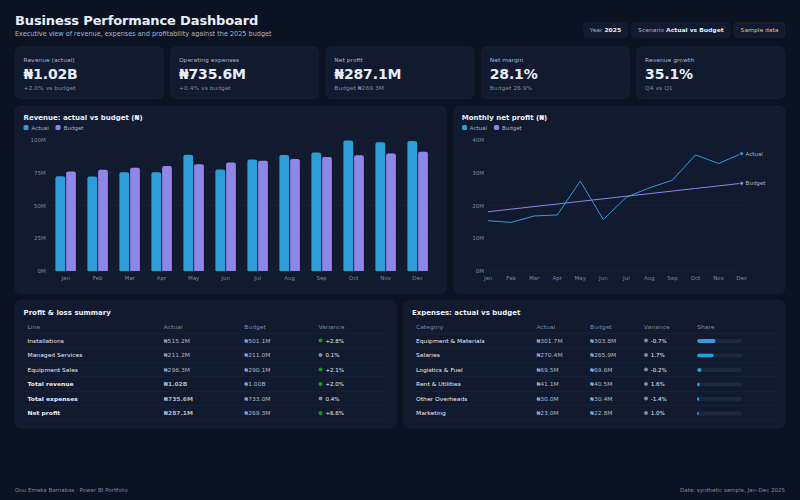
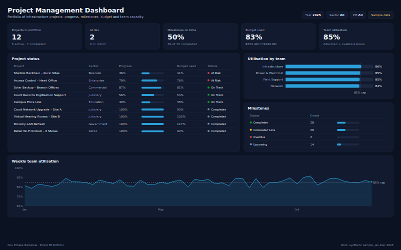
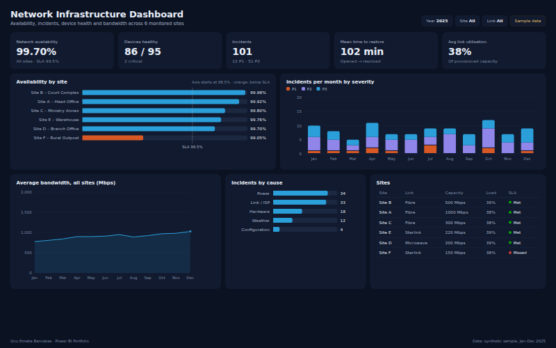
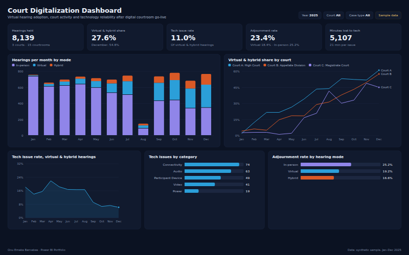

# Power BI Portfolio

Business intelligence projects by **Onu Emeka Barnabas**, project manager, network engineer and data analyst. Each project is a Power BI report with its dataset, data model, DAX measures, SQL and documentation, drawn from the kind of work I deliver: logistics, sales, finance, project delivery, network operations and court digitalization.

Portfolio: [onuemekaportfolio.vercel.app/projects](https://onuemekaportfolio.vercel.app/projects?category=Data+Analytics)

## Projects

| Dashboard | What it covers | Tools | Headline (sample data) |
|---|---|---|---|
| [Logistics Operations Dashboard](Logistics-Dashboard/) | Shipment volumes, route efficiency, delivery performance and operational KPIs. | Power BI · SQL · Excel | Total shipments: **3,303** · On-time delivery: **88.2%** |
| [Sales Performance Dashboard](Sales-Dashboard/) | Revenue trends, product profitability, regional breakdown and customer segments. | Power BI · SQL · Excel | Revenue: **₦1.83B** · Gross profit: **₦486.9M** |
| [Business Performance Dashboard](Business-Performance-Dashboard/) | Executive P&L, budget vs actual, margins and revenue growth. | Power BI · SQL | Revenue (actual): **₦1.02B** · Operating expenses: **₦735.6M** |
| [Project Management Dashboard](Project-Management-Dashboard/) | Project status, milestones, budget use and team utilisation. | Power BI · Excel | Projects in portfolio: **12** · At risk: **2** |
| [Network Infrastructure Dashboard](Network-Infrastructure-Dashboard/) | Site availability against SLA, incidents, MTTR, device health and bandwidth. | Power BI · SQL | Network availability: **99.70%** · Devices healthy: **86 / 95** |
| [Court Digitalization Dashboard](Court-Digitalization-Dashboard/) | Virtual hearing adoption, tech issue rates and adjournments after digital courtroom go-live. | Power BI · Excel | Hearings held: **8,139** · Virtual & hybrid share: **27.6%** |

### [Logistics Operations Dashboard](Logistics-Dashboard/)

Shipment volumes, route efficiency, delivery performance and operational KPIs.

[](Logistics-Dashboard/)

### [Sales Performance Dashboard](Sales-Dashboard/)

Revenue trends, product profitability, regional breakdown and customer segments.

[](Sales-Dashboard/)

### [Business Performance Dashboard](Business-Performance-Dashboard/)

Executive P&L, budget vs actual, margins and revenue growth.

[](Business-Performance-Dashboard/)

### [Project Management Dashboard](Project-Management-Dashboard/)

Project status, milestones, budget use and team utilisation.

[](Project-Management-Dashboard/)

### [Network Infrastructure Dashboard](Network-Infrastructure-Dashboard/)

Site availability against SLA, incidents, MTTR, device health and bandwidth.

[](Network-Infrastructure-Dashboard/)

### [Court Digitalization Dashboard](Court-Digitalization-Dashboard/)

Virtual hearing adoption, tech issue rates and adjournments after digital courtroom go-live.

[](Court-Digitalization-Dashboard/)

## What each project folder contains

```
<Project>-Dashboard/
├── README.md         business use case, dataset dictionary, data model, KPI + DAX definitions, build steps
├── summary.json      headline KPIs computed from the dataset
├── dataset/          CSV source data
├── sql/              schema.sql and kpis.sql (PostgreSQL)
├── screenshots/      report.png, thumbnail.png, report.html
└── powerbi/          the .pbix report file
```

## About the data

The datasets are **synthetic**. They're generated by [`scripts/generate-data.mjs`](scripts/generate-data.mjs) with fixed seeds, so every run gives the same files, and they're shaped like real operational data: seasonality, route and site differences, adoption curves after a go-live. Names of sites, courts and people are anonymised. None of the figures describe a real organisation.

The report previews in `screenshots/` are rendered from these same CSVs by [`scripts/build-dashboards.mjs`](scripts/build-dashboards.mjs), so every number in an image can be traced to the data and checked with the SQL in each project.

## Rebuild everything

```bash
npm install
npx playwright install chromium   # only needed for screenshots
npm run all                       # data → summaries + previews → PNG screenshots
```

## Power BI theme

[`theme/giantbase-dark.json`](theme/giantbase-dark.json) matches the previews. In Power BI Desktop: **View → Themes → Browse for themes**. The series colours are checked for colour-blind separation and contrast on the dark background.

## Contact

- Email: emekaonu7@gmail.com
- LinkedIn: [onu-emeka-213328208](https://www.linkedin.com/in/onu-emeka-213328208/)
- GitHub: [giantbase17](https://github.com/giantbase17)
