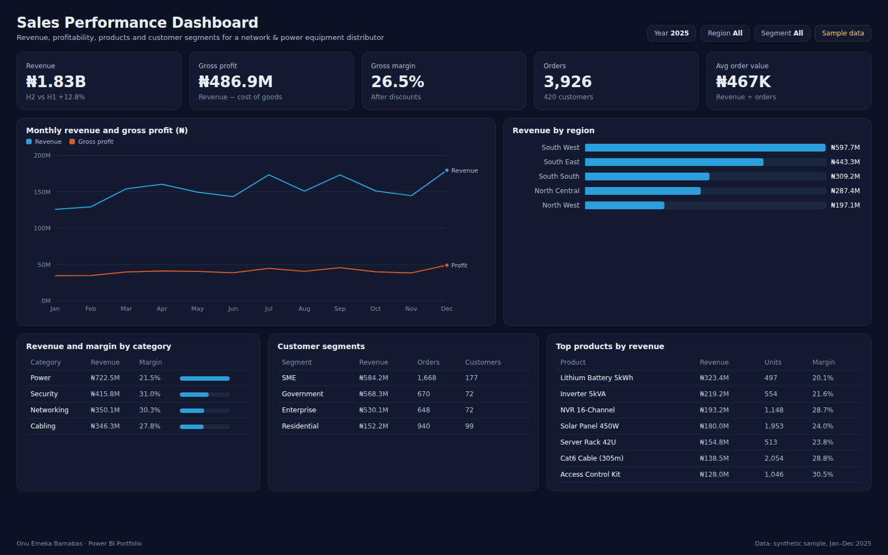

# Sales Performance Dashboard

Business intelligence dashboard giving visibility into sales performance, revenue trends, customer segments and product profitability for a distributor of networking, security, power and cabling equipment.



**Tools:** Power BI · SQL · Excel
**Data:** synthetic sample data for January–December 2025 (see [Dataset](#dataset))

## Business use case

Sales leadership wants to know where revenue comes from and which of it is profitable. The report shows the months, regions and segments that carry the business, and flags high-revenue products with thin margins so pricing and discount policy can be reviewed.

### Questions the report answers

- How is revenue trending month by month, and is profit keeping pace?
- Which regions and customer segments bring in the most revenue?
- Which product categories carry the best margin after discounts?
- Which products lead on revenue, and at what margin?

### Features

- Revenue trends
- Product analysis
- Regional breakdown
- Profit tracking
- Customer insights

## Headline figures (sample data)

| KPI | Value | Context |
|---|---|---|
| Revenue | ₦1.83B | H2 vs H1 +12.8% |
| Gross profit | ₦486.9M | Revenue − cost of goods |
| Gross margin | 26.5% | After discounts |
| Orders | 3,926 | 420 customers |
| Avg order value | ₦467K | Revenue ÷ orders |

## Report layout

- KPI cards: revenue, gross profit, margin, orders, average order value
- Line chart: monthly revenue and gross profit
- Bar chart: revenue by region
- Table with data bars: revenue and margin by category
- Table: revenue, orders and customers by segment
- Table: top products by revenue with units and margin

## Dataset

All files are in [`dataset/`](dataset/). The data is synthetic: generated by [`scripts/generate-data.ts`](../scripts/generate-data.ts) with a fixed seed, shaped to behave like real operations data. Names of sites, courts and people are anonymised and do not describe any real organisation.

### `sales.csv` · Fact · 3,926 rows

One row per order line.

| Column | Description |
|---|---|
| `OrderID` | Order reference |
| `OrderDate` | Order date |
| `CustomerID` | Customer key |
| `ProductID` | Product key |
| `Quantity` | Units sold |
| `UnitPriceNGN` | List price per unit |
| `Discount` | Discount rate applied (0–0.12) |
| `RevenueNGN` | Quantity × price × (1 − discount) |
| `COGSNGN` | Quantity × unit cost |
| `ProfitNGN` | Revenue − COGS |

### `products.csv` · Dimension · 12 rows

12 products.

| Column | Description |
|---|---|
| `ProductID` | Product key |
| `Product` | Product name |
| `Category` | Networking, Security, Power or Cabling |
| `UnitCostNGN` | Landed cost per unit |
| `ListPriceNGN` | Standard selling price |

### `customers.csv` · Dimension · 420 rows

420 customers.

| Column | Description |
|---|---|
| `CustomerID` | Customer key |
| `Segment` | Enterprise, SME, Government or Residential |
| `Region` | Nigerian geopolitical zone |

### Data model

Star schema: `products` 1 → * `sales`, `customers` 1 → * `sales`, `Date` 1 → * `sales[OrderDate]`.

## KPI definitions and DAX measures

**Revenue**. Net revenue after discounts.

```dax
Revenue = SUM ( sales[RevenueNGN] )
```

**Gross Profit**. Revenue minus cost of goods sold.

```dax
Gross Profit = SUM ( sales[ProfitNGN] )
```

**Gross Margin %**. Gross profit as a share of revenue.

```dax
Gross Margin % = DIVIDE ( [Gross Profit], [Revenue] )
```

**Orders**. Number of order lines.

```dax
Orders = COUNTROWS ( sales )
```

**Avg Order Value**. Revenue per order line.

```dax
Avg Order Value = DIVIDE ( [Revenue], [Orders] )
```

**Revenue H2 vs H1**. Second-half growth over the first half.

```dax
H2 vs H1 % =
VAR H1 = CALCULATE ( [Revenue], 'Date'[Month Number] <= 6 )
VAR H2 = CALCULATE ( [Revenue], 'Date'[Month Number] > 6 )
RETURN DIVIDE ( H2 - H1, H1 )
```

## SQL

- [`sql/schema.sql`](sql/schema.sql) creates the tables (PostgreSQL syntax; load the CSVs with `\copy`).
- [`sql/kpis.sql`](sql/kpis.sql) reproduces the main KPIs so figures can be checked outside Power BI.

## Build it in Power BI Desktop

1. **Get data → Text/CSV** and load every file in `dataset/` (or connect to the SQL tables).
2. In Power Query, set column types (dates, whole numbers, decimals) and add a `Date` table (`CALENDAR(DATE(2025,1,1), DATE(2025,12,31))`) marked as a date table.
3. Create the relationships listed under **Data model**.
4. Add the DAX measures above in a dedicated `_Measures` table.
5. Build the page to match `screenshots/report.png`, apply the theme in [`../theme/giantbase-dark.json`](../theme/giantbase-dark.json), and save as `powerbi/Sales.pbix`.

## Files

```
Sales-Dashboard/
├── README.md
├── summary.json          headline KPIs computed from the dataset
├── dataset/              CSV source data
├── sql/                  schema and KPI queries
├── screenshots/          report.png, thumbnail.png, report.html (static preview)
└── powerbi/              Sales.pbix
```
